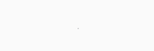
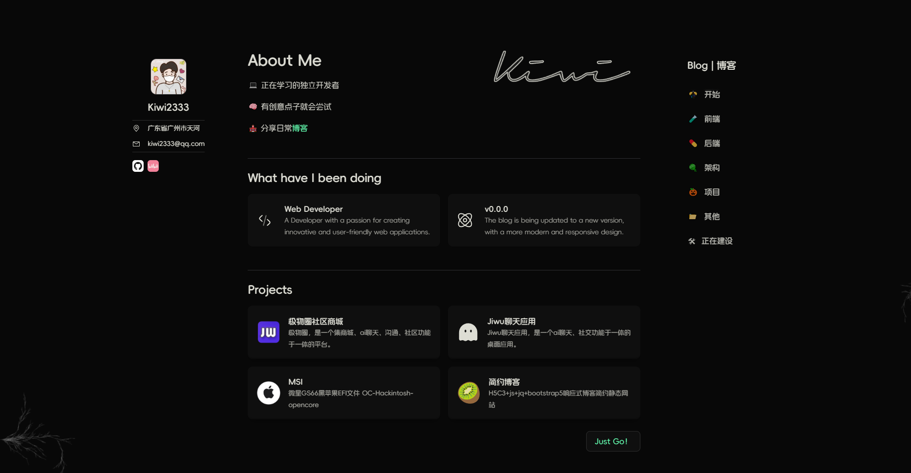
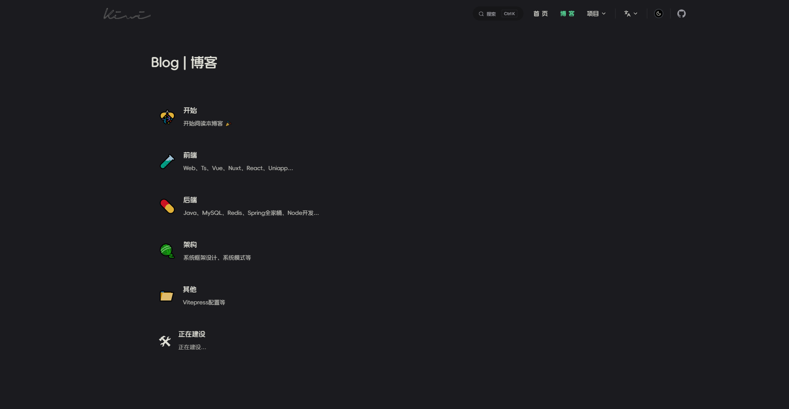
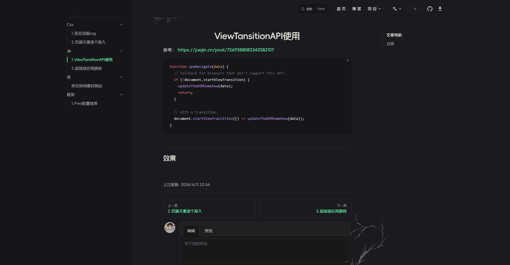
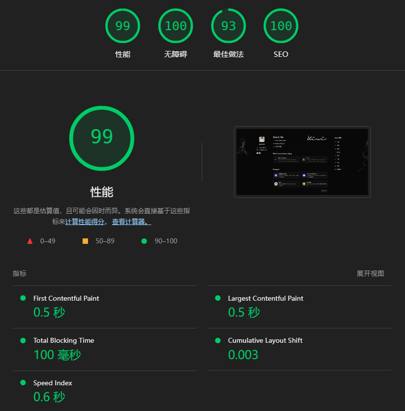

  

  

  Experience Address: [Kiwi2333](https://kiwi233.top)
  
  Language: English | [简体中文](./README.md)

## 🌐 Project Introduction

Kiwi2333 is a personal blog built with Next.js and Tailwind CSS. It provides a simple and clean interface for users to read and manage their blogs.

## 📷 Screenshots

## 🎉 Lighthouse 评分

## 🚀 Getting Started

To get started with Kiwi2333, follow these steps:

1. Install Node.js (version >= 18)
2. Install pnpm globally by running `npm install -g pnpm`
3. Change to the project directory and run `pnpm install`

## 🎨 Development

To start the development server, run `pnpm run dev`.

## 📦 Packaging

To package the project, run `pnpm run build`.

## 🎉 Deployment

For static hosting, you can upload the built files to a web server or use services like Netlify, Vercel, or GitHub Pages.
