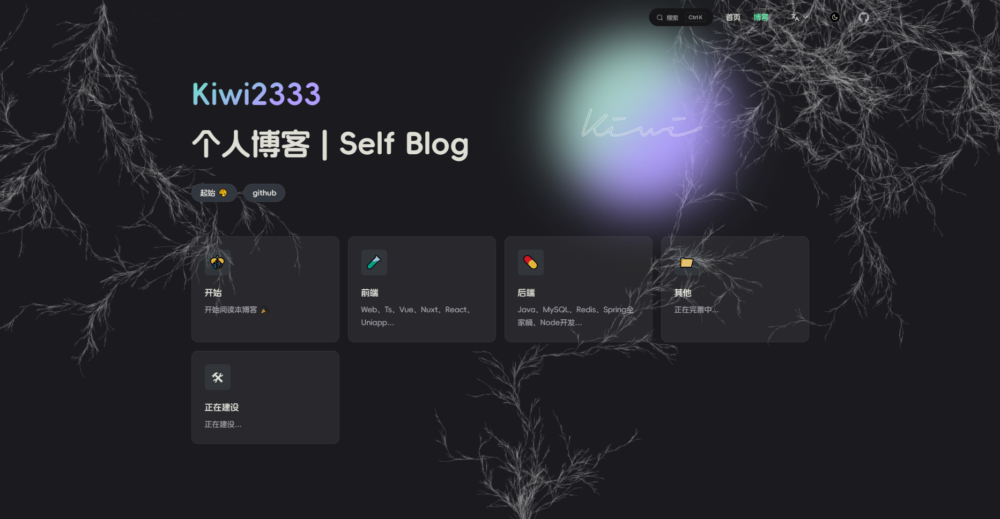

# Kiwi博客

[](https://app.netlify.com/sites/kiwiblog/deploys)

## 项目

项目地址：[Netlify 部署](https://kiwi233.top)





## ⏳ 起步 | Project Setup

```sh
# node 版本 >= 18
npm install -g pnpm
pnpm install
```

### ✨ 开发

```sh
pnpm run dev
```

### 📦 打包

```sh
pnpm run build
```

### 🎊 部署

静态托管

### ❌ pnpm install error

查看源

```sh
pnpm get registry 
```

临时修改

```sh
pnpm --registry https://registry.npm.taobao.org install any-touch
```

持久使用

```sh
pnpm config set registry https://registry.npm.taobao.org
```

还原

```sh
pnpm config set registry https://registry.npmjs.org
```
