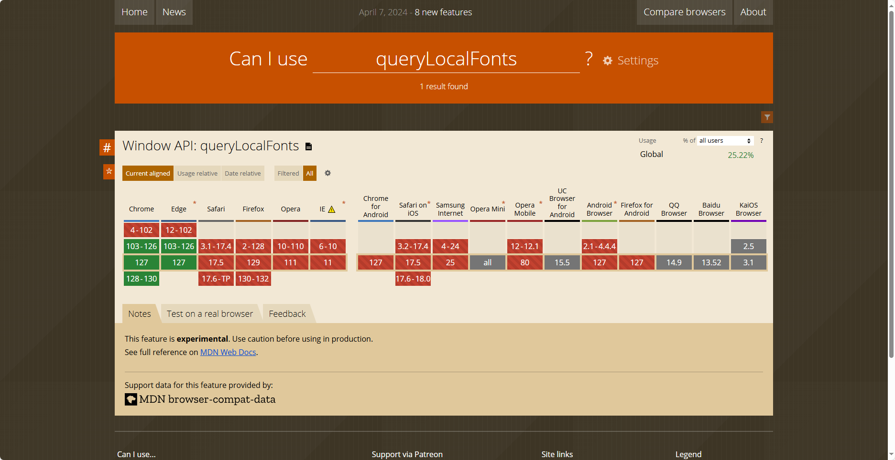

# 你不知道的js新特性

- 概况：本文将介绍一些你可能不知道的js新特性，包括获取系统字体等API。
- 使用前需要知道兼容性：[Can I use](https://caniuse.com)

## 1. 获取系统字体 window.queryLocalFonts

> [MDN文档](https://developer.mozilla.org/zh-CN/docs/Web/API/Window/queryLocalFonts)

### 1.1 示例

```javascript
// 异步函数logFontData，用于查询并记录本地可用字体的相关数据
async function logFontData() {
  try {
    // 查询本地可用字体
    const availableFonts = await window.queryLocalFonts();
    // 遍历每个字体数据并记录其postscriptName、fullName、family和style
    for (const fontData of availableFonts) {
      console.log(fontData.postscriptName);
      console.log(fontData.fullName);
      console.log(fontData.family);
      console.log(fontData.style);
    }
  } catch (err) {
    // 捕获并记录错误信息
    console.error(err.name, err.message);
  }
}
```

### 1.2 兼容性


