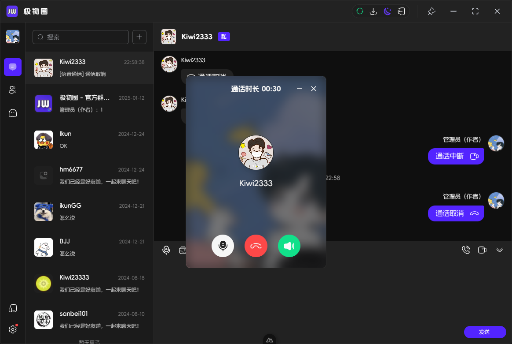
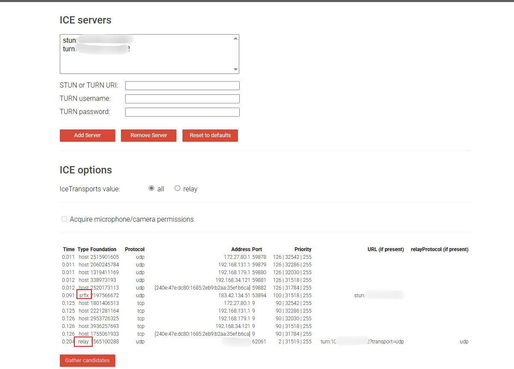

# webRTC实现的语音、视频通话

## 参考效果



## 推荐参考文章
- [51CTO WebRTC 文章](https://www.51cto.com/article/804851.html) ⭐⭐⭐⭐⭐
- [MDN WebRTC API](https://developer.mozilla.org/zh-CN/docs/Web/API/WebRTC_API) ⭐⭐⭐⭐
- [WebRTC 基础知识](https://web.developers.google.cn/articles/webrtc-basics?hl=zh-cn#rtcpeerconnection_api_plus_servers) ⭐⭐⭐⭐
- [WebRTC 基础设施](https://web.dev/articles/webrtc-infrastructure?hl=zh-cn#peer_discovery) ⭐⭐⭐
- [使用 Pion 构建的 WebRTC 应用的连接建立过程](https://tonybai.com/2024/12/26/exploring-the-connection-establish-process-of-webrtc-app-built-with-pion/) ⭐⭐⭐


## 1. 基础概括
WebRTC（Web Real-Time Communication）是一种支持网页浏览器进行实时语音对话或视频聊天的技术。它允许音频、视频和数据在用户之间直接传输，而无需中介服务器。

## 2. STUN/TURN 服务器搭建与测试
STUN（Session Traversal Utilities for NAT）和 TURN（Traversal Using Relays around NAT）服务器用于帮助 WebRTC 应用穿越 NAT（网络地址转换）和防火墙。

> 配置 STUN 服务器可以使用公共 STUN 服务器，例如 Google 的 `stun:stun.l.google.com:19302`。

### 1）使用coturn搭建STUN/TURN服务器

- 安装coturn服务器：`sudo apt-get install coturn`
- 配置coturn服务器：

```text
listening-port=[监听端口]
external-ip=服务器公网ip
min-port=49152 # 端口范围
max-port=65535 # 端口范围
no-cli
realm=[域名]
# no-auth # 关闭验证
user=[账号:密码]
```

### 2）测试 STUN/TURN 服务器
- 使用 [Trickle ICE](https://webrtc.github.io/samples/src/content/peerconnection/trickle-ice/) 页面测试 STUN/TURN 服务器的功能。
- 在页面中输入 STUN/TURN 服务器的 URI，观察候选者的收集情况。



## 3. WebRTC 通讯的最简易流程 

1. **获取用户媒体**：使用 `getUserMedia` API 获取音频和视频流。
2. **创建 PeerConnection**：使用 `RTCPeerConnection` 创建连接。
3. **添加媒体流**：将获取的媒体流添加到 PeerConnection。
4. **交换信令**：通过信令服务器交换 SDP（Session Description Protocol）和 ICE 候选者。
5. **建立连接**：完成 ICE 候选者的收集和连接的建立。
6. **开始通讯**：一旦连接建立，用户可以开始实时音视频通讯。


## 4. 实现语音视频的基础案例
# 构建简易的WebRTC视频、语音通信案例

### （一）环境准备
1. **浏览器**：确保使用支持WebRTC的浏览器，如Chrome、Firefox等。
2. **开发工具**：推荐使用Visual Studio Code等代码编辑器，便于编写和调试代码。
3. **基础框架**：以Vue.js为例，创建一个新的Vue项目，用于承载我们的WebRTC通信功能。

### （二）核心代码解析

#### 1. 基础设置

定义一些基础的接口和变量，用于存储通话相关信息、设备信息、状态等。

```typescript
interface RtcMsgVO {
  roomId: number;
  callType: CallTypeEnum;
  senderId: string;
  [key: string]: any;
}

const MAX_TIME_OUT_SECONDS = 30; // 拨打超时时间
```

#### 2. WebRTC连接与通信

##### （1）创建PeerConnection
这是WebRTC通信的核心，用于建立两个浏览器之间的连接。

```typescript
const configuration: RTCConfiguration = {
  iceServers: [
    { urls: "stun:stun.l.google.com:19302" },
    // 可添加更多STUN/TURN服务器
  ],
};

const peerConnection = new RTCPeerConnection(configuration);
```

##### （2）处理信令交换
信令交换是WebRTC通信中不可或缺的一环，用于在两个通信端之间传递Offer、Answer以及Candidate等信息。

```typescript
// 创建并发送Offer
const offer = await peerConnection.createOffer();
await peerConnection.setLocalDescription(offer);
// 发送Offer到对方
... 这里ws、http等协议发送

// 处理收到的Offer
await peerConnection.setRemoteDescription(offer);
const answer = await peerConnection.createAnswer();
await peerConnection.setLocalDescription(answer);
// 发送Answer到对方
... 这里ws、http等协议发送
```

##### （3）媒体流处理
获取本地媒体流，并将其添加到PeerConnection中，同时监听远程流。

```typescript
const localStream = await navigator.mediaDevices.getUserMedia({ audio: true, video: true });
peerConnection.addStream(localStream);

peerConnection.ontrack = (event) => {
  const remoteStream = event.streams[0];
  // 处理远程流，如显示在视频元素中
};
```

#### 3. 设备管理
获取并管理音频、视频设备，允许用户切换设备。

```typescript
const audioDevices = await navigator.mediaDevices.enumerateDevices().then(devices =>
  devices.filter(device => device.kind === "audioinput")
);

const videoDevices = await navigator.mediaDevices.enumerateDevices().then(devices =>
  devices.filter(device => device.kind === "videoinput")
);
```

### （三）功能实现

#### 1. 发起通话
整合上述代码，实现发起视频或语音通话的功能。

```typescript
async function startCall(roomId, type) {
  // 获取设备、创建PeerConnection、发送Offer等操作
  createPeerConnection();

  // 处理收到的ws消息
  ws.onmessage = (event) => {
    const msg = JSON.parse(event.data);
    if (msg.type === "offer") {
      handleOffer(msg.offer);
    }
    ... 处理其他消息类型
  };
  // 定时器，超时未收到Answer，结束通话
  setTimeout(() => {
    endCall();
  }, MAX_TIME_OUT_SECONDS * 1000);
}
```

#### 2. 接听通话
处理收到的通话请求，实现接听功能。

```typescript
async function handleOffer(offer) {
  // 处理Offer、创建Answer、发送Answer等操作
  createPeerConnection();

  // 处理收到的ws消息
  ws.onmessage = (event) => {
    const msg = JSON.parse(event.data);
    if (msg.type === "answer") {
      handleAnswer(msg.answer);
    }
    ... 处理其他消息类型
  };
  // 定时器，超时未收到ICE Candidate，结束通话
  setTimeout(() => {
    endCall();
  }, MAX_TIME_OUT_SECONDS * 1000);
}
```

#### 3. 结束通话
清理资源，结束通话。

```typescript
async function endCall() {
  // 关闭PeerConnection、停止媒体流、清理定时器等操作
  peerConnection.close();
  localStream.getTracks().forEach(track => track.stop());
  clearTimeout(timer);
  ... 处理其他结束操作
}
```
