# Electron 如何打包生成exe安装包

> [Electron 如何打包生成exe安装包](https://segmentfault.com/a/1190000041318873)

我们用electron打包生成跨平台软件，官方推荐的打包方式先说一下有两种.
第一种是：electron-packager
第二种是：electron-builder
这两种有什么不同呢？

1. electron-packager 打包会生成

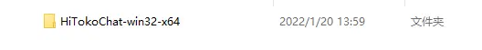

2. electron-builder 打包会生成

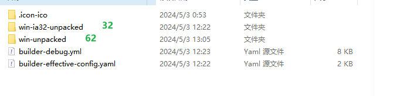

这样的多类型的安装程序
*注意本文讲的就是第一种electron-packager 打包 不能生成安装包的解决方案
这里就要提一下 nsis 这个东西了！

NSIS中文版下载地址：<https://pan.baidu.com/s/1mitSQU0>
也可以自行百度下载
关闭杀毒软件 一直下一步 安装完成

然后傻瓜式安装如下;

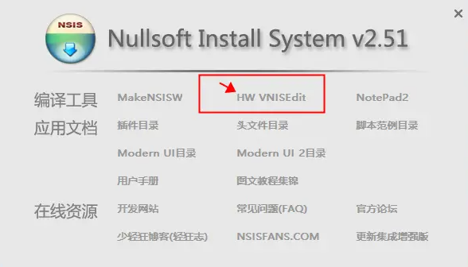

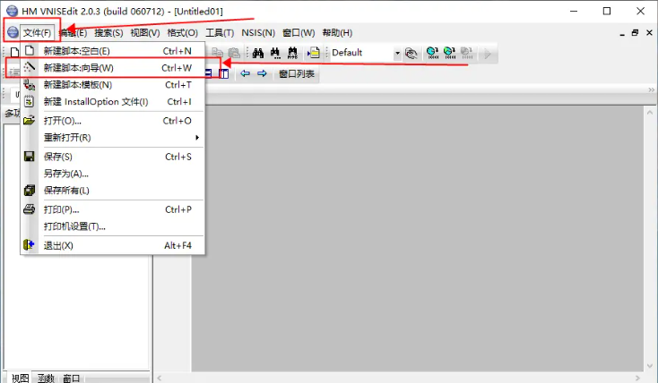

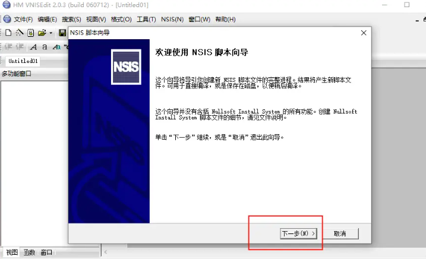

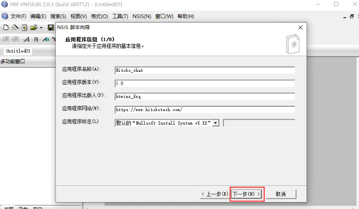

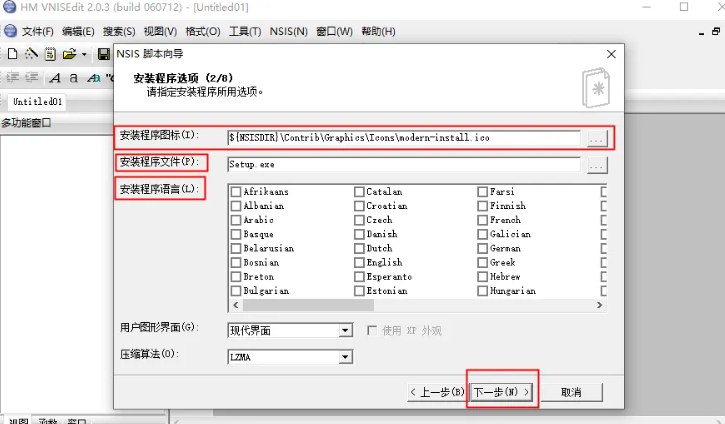

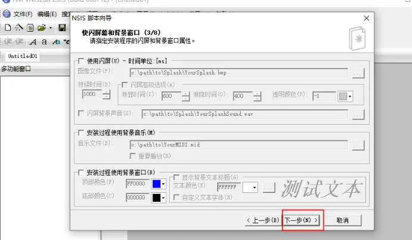

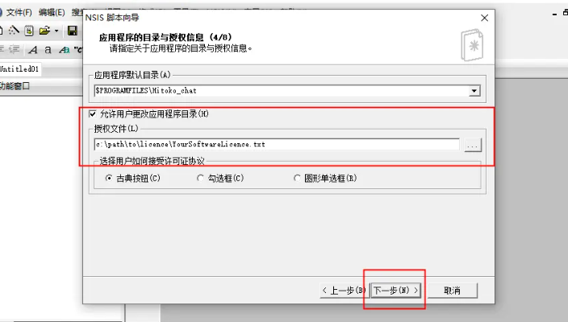

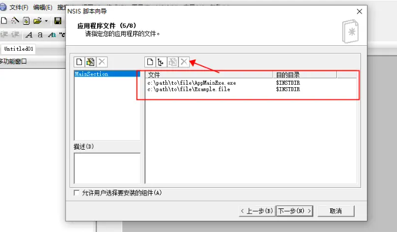

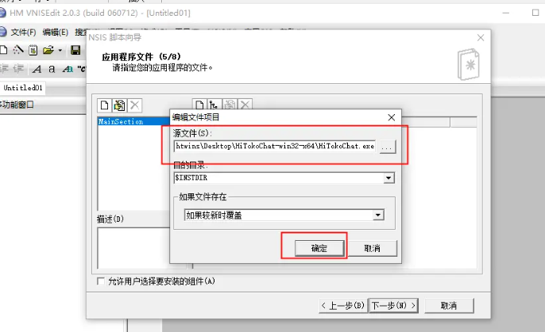

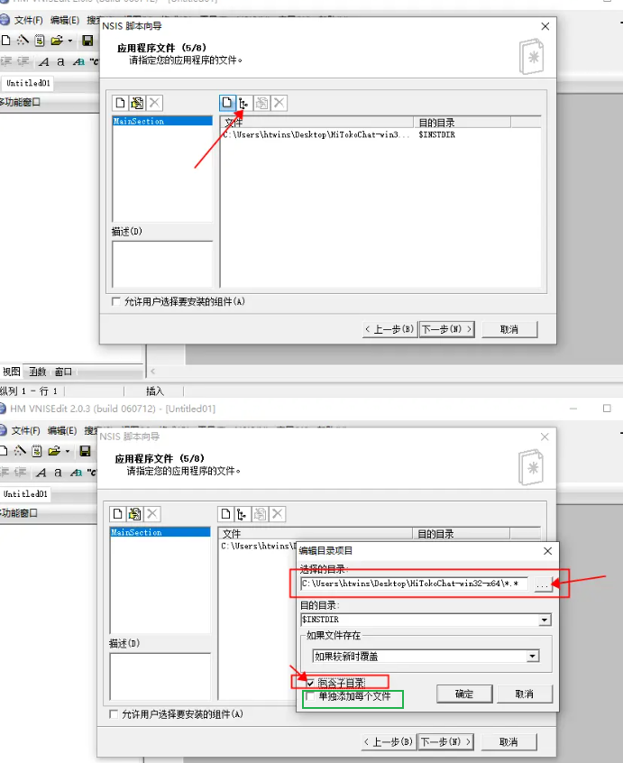

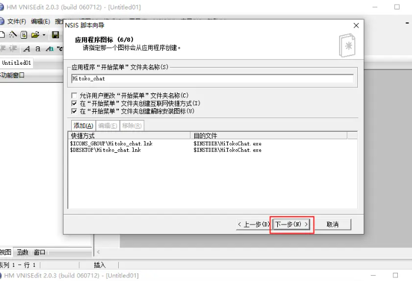

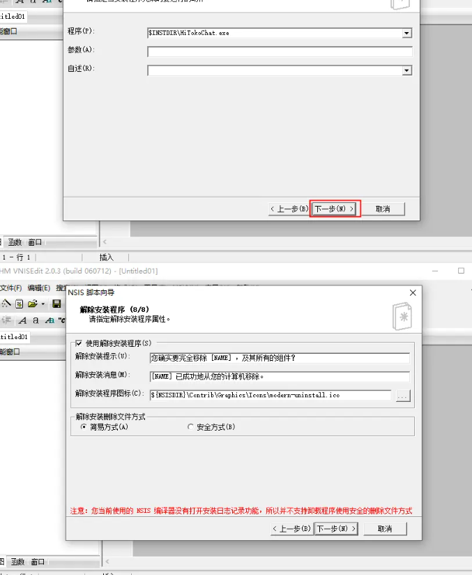

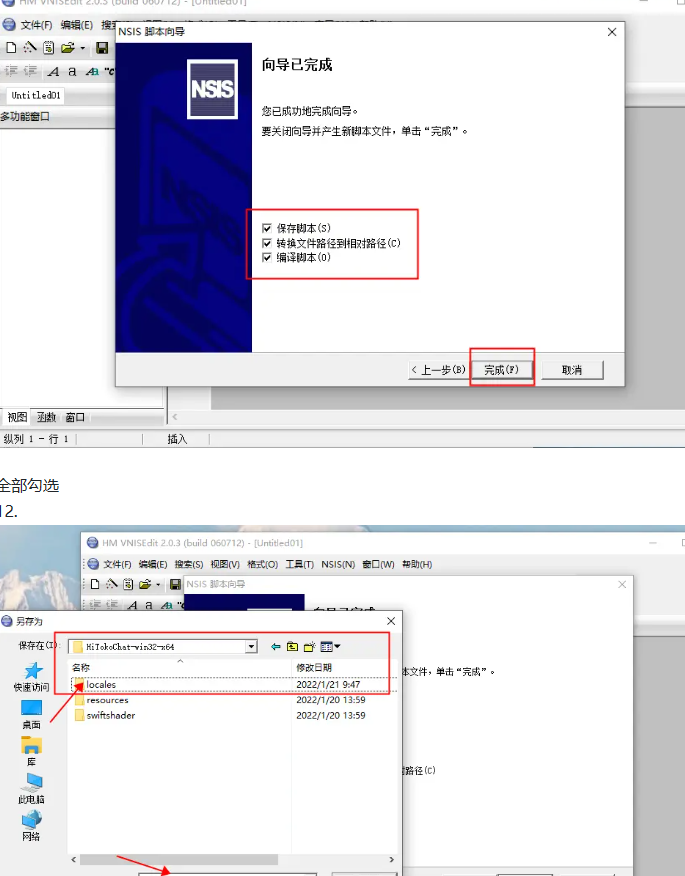
