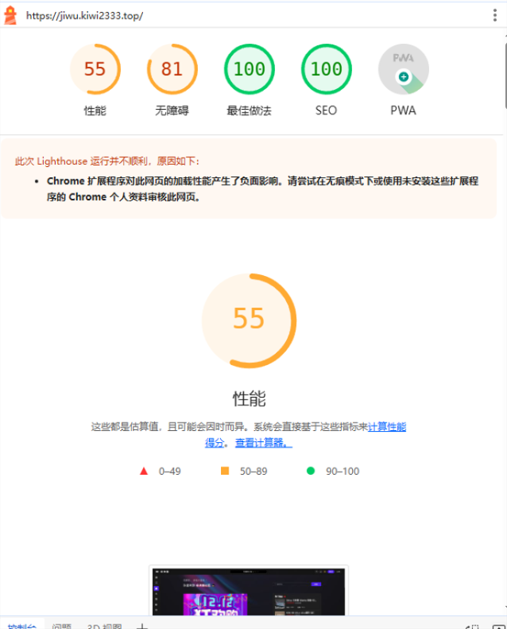
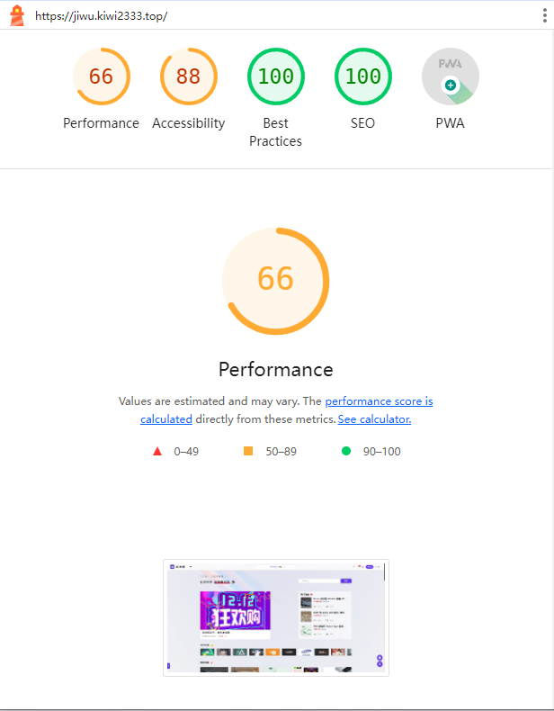
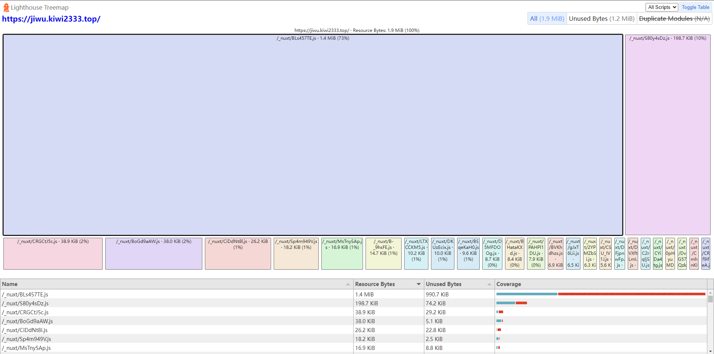
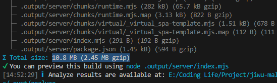
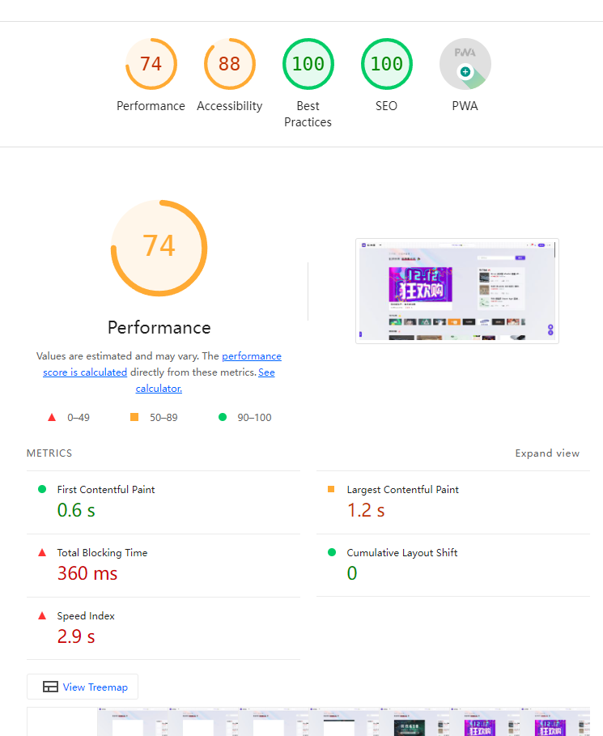

---
# https://vitepress.dev/reference/default-theme-home-page
layout: doc
title: "Nuxt优化"
---

# Nuxt优化

> 前言：推荐查看[Nuxt3优化](https://nomx.dev/posts/nuxt3-optimization/)
> [Nuxt3 + vite优化](https://wenku.csdn.net/answer/fd406d3b99d741b0aa3d4e87eaf10b93)

## 1、lightnight 灯塔评分

| 优化前 | 优化后  |
| --- | ---  |
|||
|遮罩logo、首屏有点`慢`等 | Oss图片、入口文件、首屏全ssr等`待优化` |

## 2、开始优化

### 1）提升首次内容绘制（FCP）速度
>
> 当其冲的任务就是减小页面显示的大体积 js 文件。现代网站的 js 脚本往往比 html 更重，当浏览器加载 html 时遇到 `<script>` 标签，就不能再继续构建 DOM，而是要等待脚本下载完成并执行结束，才能继续处理其余的内容。

- 查看treemap


- 优化方案：

1. `/_nuxt/BLs457TE.js`文件过大，优化方案：

> 分包 [vite分包](<https://github.com/sanyuan0704/vite-plugin-chunk-split/blob/HEAD/README-CN.md>)

```js
// 分包、拆包
// https://github.com/sanyuan0704/vite-plugin-chunk-split/blob/HEAD/README-CN.md
chunkSplitPlugin({
  strategy: "default",
  customSplitting: {
    "plugins": [/plugins/],
    "composables": [/composables/],
    "element-china-area-data": [/element-china-area-data/],
  },
}),
```

|成果|优化项|
|---|---|
||vite分包、拆包|
||`lightnight`|

## #最后考虑

### 1）web worker进程渲染 [Partytown🎉](https://zhuanlan.zhihu.com/p/452678872)
