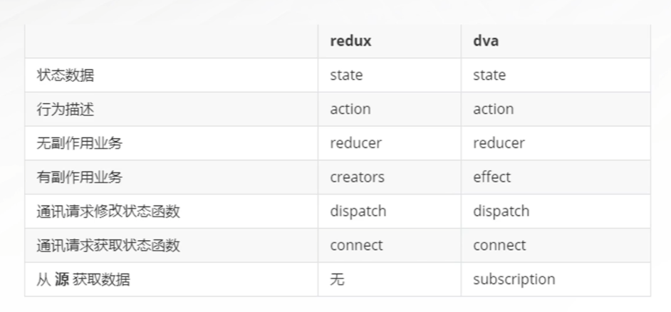
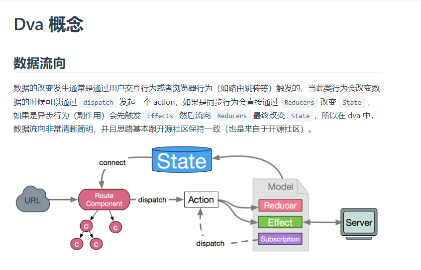

# Umi 学习
>
> 学习视频：[千锋教育前端框架Umi3教程，企业级必学前端框架Umi3视频](https://www.bilibili.com/video/BV1pG411879j?p=18&vd_source=5a92b42b9c4477c241fa7717e9e8504a)

> 文档：[Umi2 官方文档](https://v2.umijs.org/zh/)

> 最新文档：[Umi4 官方文档](https://umijs.org/zh-CN/docs/introduce)

## 1、Umi 总览

## 2、状态管理 - Dva
[官方文档](https://dvajs.com/api/#%E8%BE%93%E5%87%BA%E6%96%87%E4%BB%B6)

### 1）总览

### 2）数据流向
>
> 1. 用户交互（dispatch）触发 action，action 调用 service 层获取数据，并返回给 model。
> 2. model 更新 state，view 层监听 state 变化，更新视图。

