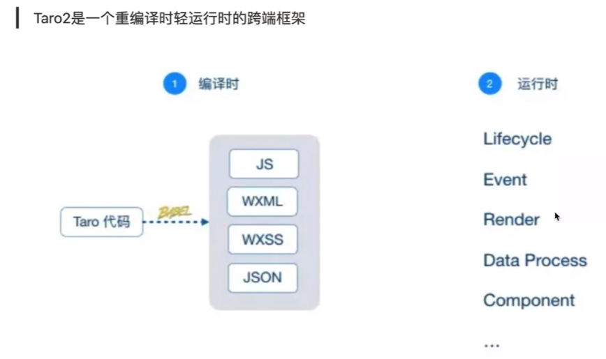
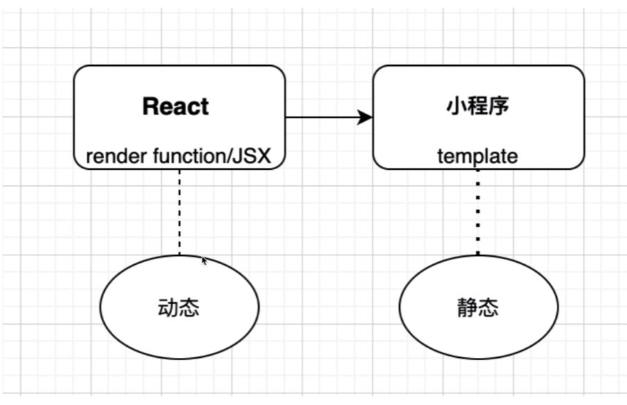
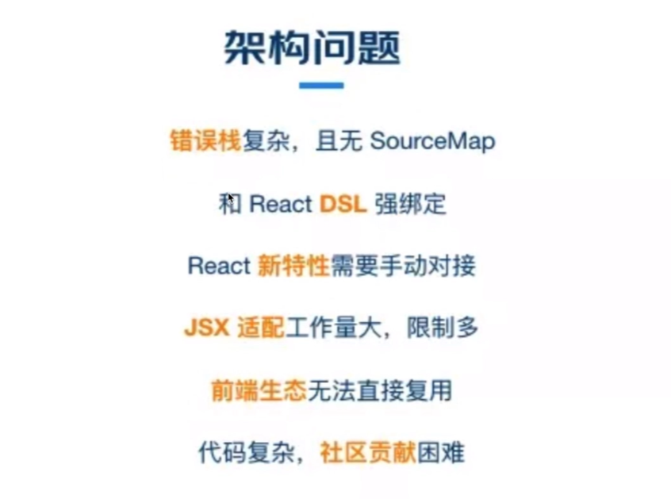
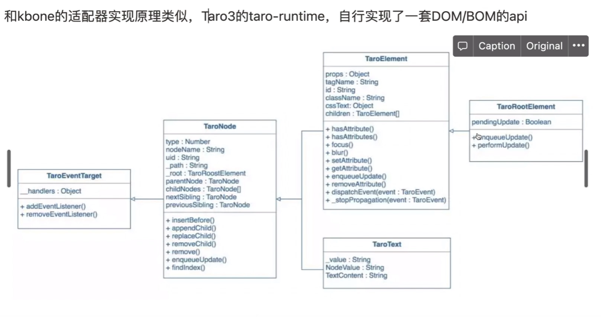
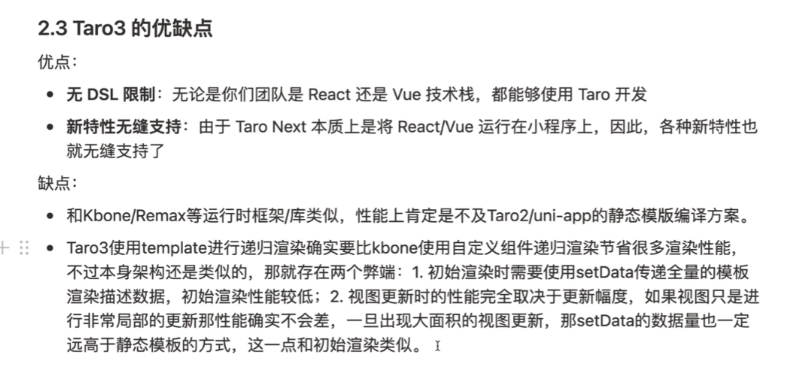
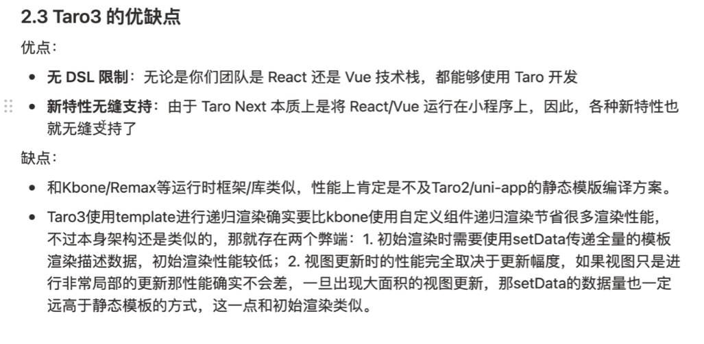

# Taro 原理

> [Taro原理总结](https://juejin.cn/post/6844903792119382030)
> [不敢阅读 npm 包源码？带你揭秘 taro init 背后的哲学](https://juejin.cn/post/6844903749945655310)

## 1、Taro2：静态渲染的跨端框架

### Taro2问题

## 2、Taro3：重运行时的垮端框架

### Taro3优缺点

