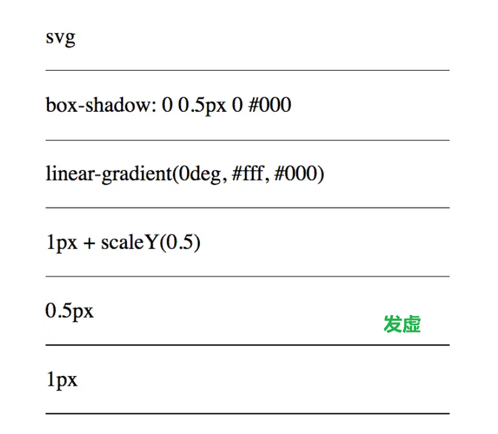
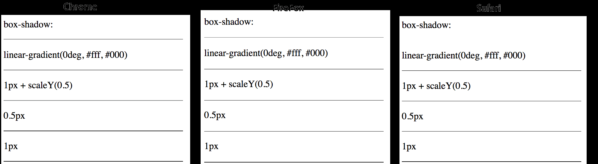
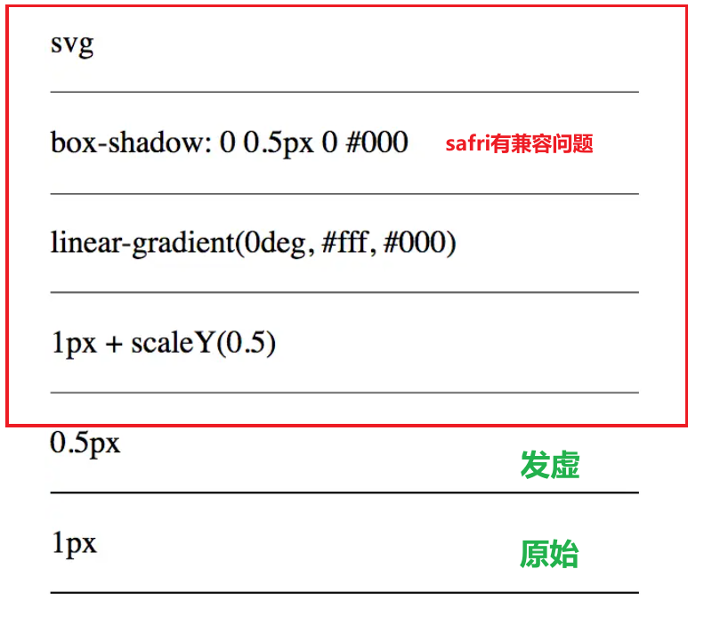

---
# https://vitepress.dev/reference/default-theme-home-page
layout: doc
title: "Css汇总"
---

# Css汇总

## 1、0.5边框

---

## 2、行内元素、块元素、行内块元素的区别和特点？

### 1）行内元素

- 特点：
  - 和其他元素都在一行上；
  - 设置宽高无效；
  - 设置`margin`的左右有效，设置上下无效；
  - 设置`padding`的上下左右都有效；
  - 宽度随内容宽度变化。
- 常见的行内元素：`< a >`、`< strong >`、`< span >`、`< label >`、`< em >`、`< i >`、`< del >`、`< cite >`、`< ins >`、`< code >`等，其中 `< span >` 标签是最典型的`行内元素`。

---

### 2）块元素

- 特点：
  - 独占一行；
  - 支持所有样式；
  - 宽度默认占父元素100%宽度；
  - 宽度随内容宽度变化。
  - 常见的块元素：`< h1 >`、`< p >`、`< div >`、`< ul >`、`< ol >`、`< li >`、`< dl >`、`< dt >`、`< dd >`、`< form >`、`< hr >`、等，其中 `< div >` 标签是最典型的`块元素`。
- 注意：`< ul >`、`< ol >`、`< li >`、`< dl >`、`< dt >`、`< dd >`、`< form >`、`< hr >`、等标签在`< li >`标签中使用时，会变成`行内元素`。

---

### 3）行内块元素

- 特点：
  - 和其他元素都在一行上；
  - 支持所有样式；
  - 默认宽度为内容宽度；
  - 设置宽高有效；
  - 设置`margin`的左右有效，设置上下无效；
  - 设置`padding`的上下左右都有效；
  - 宽度随内容宽度变化。
- 常见的行内块元素：`< img />`、`< input />`、`< select >`、`< textarea >`、`< button >`、等，其中 `< img />` 标签是最典型的`行内块元素`。
