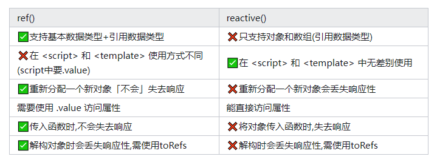

---
# https://vitepress.dev/reference/default-theme-home-page
layout: doc
title: "Vue2和Vue3的一些区别"
---

# Vue2和Vue3的一些区别

## 1、响应式系统

> Vue3使用Proxy对象来实现响应式系统，而Vue2使用Object.defineProperty()方法。Proxy对象提供了更强大的代理功能，可以拦截更多的操作，包括对数组和对象属性的添加、删除和修改。而Object.defineProperty()方法只能拦截对属性的读取、修改和删除操作。因此，Vue3的响应式系统更加完善和强大。

## 2、选项式API和组合式API

> Vue3引入了组合式API，允许将组件逻辑封装到可重用的函数中。同时，Vue3还保留了选项式API，以便与Vue2兼容。组合式API允许将组件逻辑拆分为更小的函数，这些函数可以被其他组件重用。而选项式API则允许将组件逻辑封装到选项对象中。因此，Vue3的组合式API更加灵活和可重用。

## 3、vue3的Ref和Reative区别？

