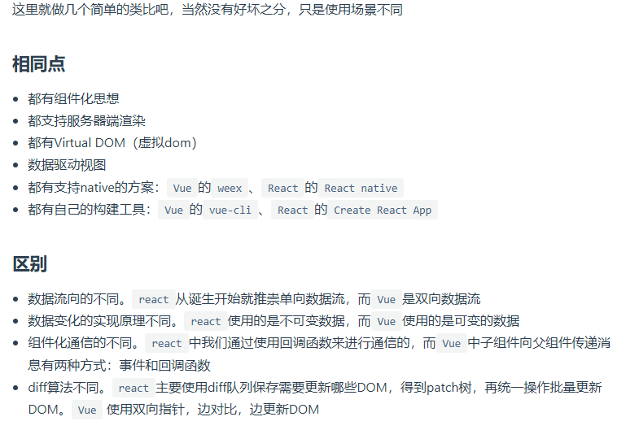
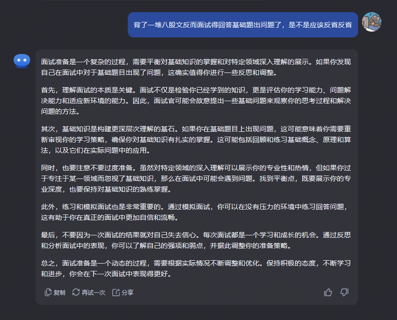

---
# https://vitepress.dev/reference/default-theme-home-page
layout: doc
title: "HYQ某某公司"
---

# HYQ某某公司

## 1、`var` 、 `let` 和 `const` 区别

[详细解释](https://vue3js.cn/interview/es6/var_let_const.html#%E5%9B%9B%E3%80%81%E5%8C%BA%E5%88%AB)

### var、let、const三者区别可以围绕下面五点展开

变量提升
暂时性死区
块级作用域
重复声明
修改声明的变量
使用

### 变量提升

var声明的变量存在变量提升，即变量可以在声明之前调用，值为undefined

let和const不存在变量提升，即它们所声明的变量一定要在声明后使用，否则报错

```js
// var
console.log(a)  // undefined
var a = 10

// let
console.log(b)  // Cannot access 'b' before initialization
let b = 10

// const
console.log(c)  // Cannot access 'c' before initialization
const c = 10
```

### 暂时性死区

var不存在暂时性死区

let和const存在暂时性死区，只有等到声明变量的那一行代码出现，才可以获取和使用该变量

```js
// var
console.log(a)  // undefined
var a = 10

// let
console.log(b)  // Cannot access 'b' before initialization
let b = 10

// const
console.log(c)  // Cannot access 'c' before initialization
const c = 10
```

### 块级作用域

var不存在块级作用域

let和const存在块级作用域

```js
// var
{
    var a = 20
}
console.log(a)  // 20

// let
{
    let b = 20
}
console.log(b)  // Uncaught ReferenceError: b is not defined

// const
{
    const c = 20
}
console.log(c)  // Uncaught ReferenceError: c is not defined
```

### 重复声明

var允许重复声明变量

let和const在同一作用域不允许重复声明变量

```js
// var
var a = 10
var a = 20 // 20

// let
let b = 10
let b = 20 // Identifier 'b' has already been declared

// const
const c = 10
const c = 20 // Identifier 'c' has already been declared
```

### 修改声明的变量

var和let可以

const声明一个只读的常量。一旦声明，常量的值就不能改变

```js

// var
var a = 10
a = 20
console.log(a)  // 20

//let
let b = 10
b = 20
console.log(b)  // 20

// const
const c = 10
c = 20
console.log(c) // Uncaught TypeError: Assignment to constant variable
```

```js
function foo() {
  var a = 0;
  console.log(a);
}

var a = 1;
foo();

const obj = {
  a: 2,
  foo: foo
};

obj.foo();

const o = new foo();
// 0 0 0
```

### 使用

能用const的情况尽量使用const，其他情况下大多数使用let，避免使用var

## 2、React和Vue的区别

[详细解释](https://vue3js.cn/interview/vue/vue.html#%E4%BA%94%E3%80%81vue%E5%92%8Creact%E5%AF%B9%E6%AF%94)


## 3、this指向问题，实际应用

[详细解释](https://vue3js.cn/interview/JavaScript/this.html#%E4%B8%80%E3%80%81%E5%AE%9A%E4%B9%89)

1） 定义：this是JavaScript中的一个关键字，它指向函数执行时的当前环境

2） this的指向在函数被调用时根据执行环境动态绑定的，无法在函数被定义时确定

3） this的指向取决于函数的调用方式，通常情况下，this的指向可以通过以下几种方式来确定

- 作为对象的方法调用时，this指向该对象。
- 作为普通函数调用时，this指向全局对象（在浏览器中，this指向window对象）。
- 使用call、apply或bind方法调用时，this指向指定的对象。

## 4、ES6新特性概括

ES6，也被称为ECMAScript 2015，是JavaScript语言的一个重大更新，引入了许多新特性，旨在提高开发效率、增强语言表现力，并使得JavaScript更加适合大型应用的开发。以下是ES6中一些关键的新特性概括：

1. **let和const声明变量**：
   - `let`允许你声明块作用域的变量，这比旧的`var`声明更加灵活和安全。
   - `const`用于声明常量，一旦赋值后不可更改。

2. **箭头函数**：
   - 箭头函数提供了一种更简洁的方式来写函数表达式，并且它不绑定自己的`this`，`arguments`，`super`或`new.target`。

3. **模板字符串**：
   - 允许嵌入表达式到字符串中，使用反引号(`` ` ``)来定义，提供了一种新的创建字符串对象的方式。

4. **解构赋值**：
   - 允许从数组和对象中提取值，按照对应位置或键名，对变量进行赋值。

5. **扩展运算符**：
   - 用于数组和对象，可以让表达式在赋值操作中展开。

6. **Promise对象**：
   - 用于异步编程，可以异步执行代码，并且能够更好地处理错误和结果。

7. **默认参数**：
   - 函数参数可以有默认值，如果调用函数时没有提供参数，则使用默认值。

8. **类（Class）**：
   - 虽然JavaScript是基于原型的语言，但ES6引入了类（Class）这个概念，提供了一种新的面向对象编程的语法糖。

9. **模块化**：
   - 引入了模块化编程的概念，使用`import`和`export`关键字来导入和导出模块。

10. **迭代器和for...of**：
    - 为数组和其他可迭代对象引入了迭代器协议，`for...of`循环可以遍历任何可迭代对象。

11. **新的集合类型（Set和Map）**：
    - `Set`允许存储任何类型的唯一值，而`Map`则存储键值对，其中键可以是任何类型。

12. **函数的增强**：
    - 包括rest参数、spread操作符、尾调用优化等。

13. **二进制数组和数据视图**：
    - `ArrayBuffer`、`TypedArray`和`DataView`提供了操作二进制数据的能力。

## 5、JS 栈内存和堆内存

### 1）栈内存和堆内存的优缺点

  1.在JS中，基本数据类型变量大小固定，并且操作简单容易，所以把它们放入栈中存储。 引用类型变量大小不固定，所以把它们分配给堆中，让他们申请空间的时候自己确定大小，这样把它们分开存储能够使得程序运行起来占用的内存最小。

  2.栈内存由于它的特点，所以它的系统效率较高。 堆内存需要分配空间和地址，还要把地址存到栈中，所以效率低于栈。

### 2）栈内存和堆内存的垃圾回收

  1.栈内存中变量一般在它的当前执行环境结束就会被销毁被垃圾回收制回收， 而堆内存中的变量则不会，因为不确定其他的地方是不是还有一些对它的引用。 堆内存中的变量只有在所有对它的引用都结束的时候才会被回收。

## 总结：过于自信，基础题都答得稀烂，面试官问的很多基础问题，我都没答好
>
> 
> 总结：应该重新审视自己的能力，不要过于自信，基础题都答得稀烂，面试官问的很多基础问题，我都没答好，需要重新学习，重新出发。
>
---
