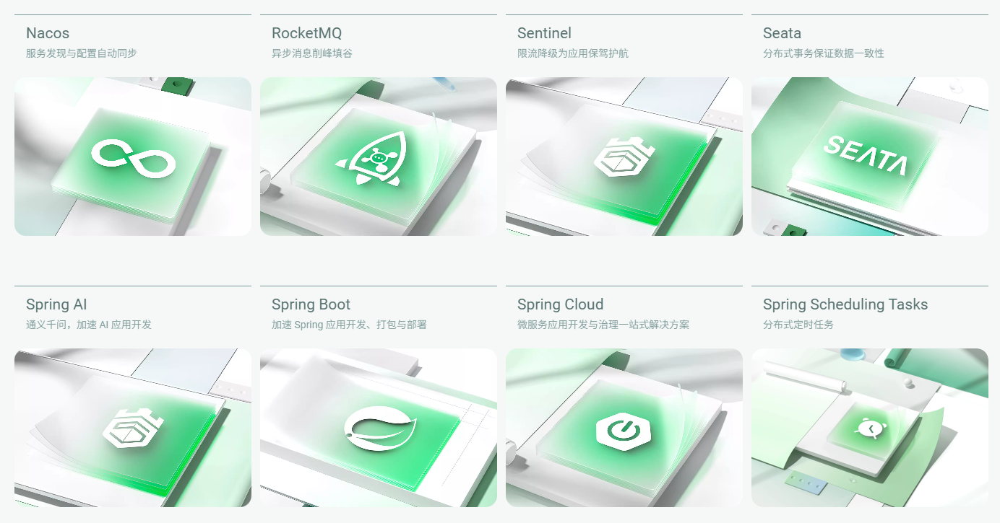
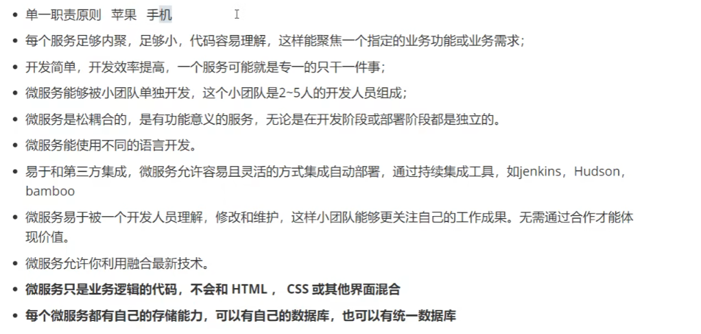
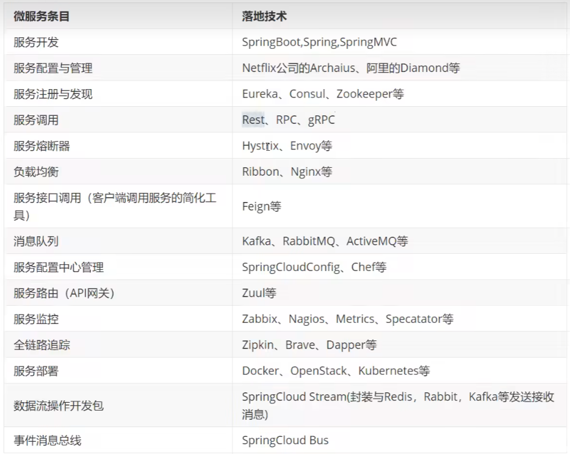
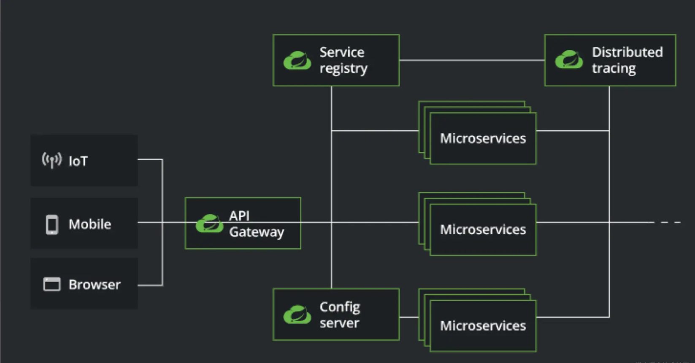
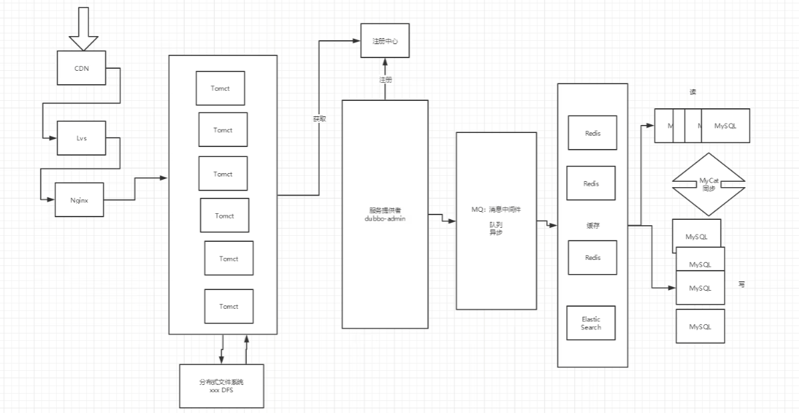
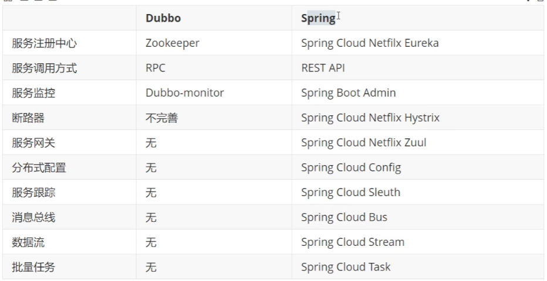

# SpringCloud入门

[SpringCloud官网](https://docs.springcloud.cc/spring-cloud-greenwich.html)

## 1. 这个阶段我们的主要学习

### 回顾和整理之前的

- JAVA基础
- 数据库
- 前端
- Mybatis
- Spring
- SpringMVC
- SpringBoot
- Dubbo、Zookeeper、分布式基础

### 微服务架构解决的问题

- 网关
- 服务间调用
- 服务治理
- 服务监控
- 服务降级
- 服务注册与发现、配置中心
- 负载均衡
- 消息总线
- 安全

### 微服务解决方案

1. SpringCloud Netflix 一站式解决方案
Api Gateway、zuul - 网关。
Feign - 声明式HTTP客户端。
Eureka - 服务注册与发现。
Ribbon - 客户端负载均衡。
Hystrix - 服务容错保护。

2. Apache Dubbo Zookeeper （部分）
API - 无
Dubbo - RPC框架。
Zookeeper - 分布式协调服务。

3. SpringCloud Alibaba 微服务解决方案 （简单）
Nacos - 服务注册与发现。
Sentinel - 服务容错保护。
RocketMQ - 消息总线。

...

## 2. 微服务架构

### 什么是微服务架构

### 微服务优缺点

- 优点：

- 缺点：

### 微服务技术栈

## 3. 什么是SpringCloud

### Dubbo和SpringCloud的选型

基础架构：

#### 1. 分布式+服务治理 Dubbo

#### 2. Dubbo和SpringCloud的对比

