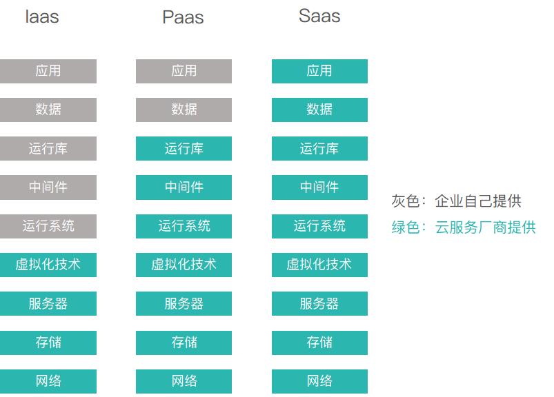

# 到底什么是SaaS系统？

<https://www.zhihu.com/question/356478148>

>

想要弄清楚什么是SaaS，绕不开IaaS、PaaS这两个概念——如果你想要建立一个网站，正常所需要的投入是：买服务器，安装服务器软件，编写网站程序。 但如果你想要采用云计算，大致有以下三种方式——

- 1️⃣采用IaaS服务，意味着你就不用自己买服务器，随便在哪家购买虚拟机，不过还是需要自己装服务器软件。

- 2️⃣采用PaaS服务，意味着你既不需要买服务器，也不需要自己装服务器软件，只需要自己开发网站程序。
- 3️⃣如果购买某些在线论坛或者在线网店的服务，意味着你不用自己开发网站程序，只需要使用它们开发好的程序，而且他们会负责程序的升级、维护、增加服务器等，你只需要专心运营即可。
- ✅这就是SaaS。

