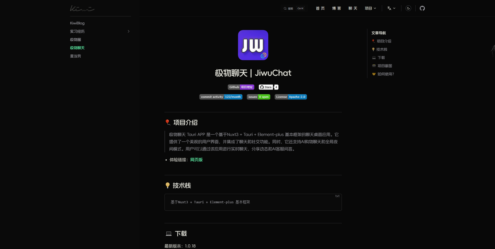

---
# https://vitepress.dev/reference/default-theme-home-page
layout: doc
index: 2
---


<script setup lang="ts">
import PublicResource from '../.vitepress/compnents/PublicResource.vue'
import JiwuChatDownTable from '../.vitepress/compnents/JiwuChatDownTable.vue'
</script>

<div text-center flex-row-c-c flex-col>
  <!--  -->
  <NavBarTitle class="hidden my-8 sm:inline float-right" />
</div>

# KiwiBlog

<!-- 公开仓库 -->
<PublicResource author="KiWi233333" repo-url="KiwiBlog" />

## 🎈 项目介绍
>
> 一个基于 VitePress + Vue3 + TypeScript 的静态博客系统。

## ☕ 体验地址

[](https://app.netlify.com/sites/kiwiblog/deploys)

  体验地址：[Kiwi2333](https://kiwi233.top)

## 📸 项目截图


<p class="text-center op-80">首页</p>


<p class="text-center op-80">博客</p>


<p class="text-center op-80">文章</p>

## ⏳ 起步 | Project Setup

```sh
# node 版本 >= 18
npm install -g pnpm
pnpm install
```

## ✨ 开发

```sh
pnpm run dev
```

## 📦 打包

```sh
pnpm run build
```

## 🎊 部署

静态托管

## ❌ pnpm install error

查看源

```sh
pnpm get registry 
```

临时修改

```sh
pnpm --registry https://registry.npm.taobao.org install any-touch
```

持久使用

```sh
pnpm config set registry https://registry.npm.taobao.org
```

还原

```sh
pnpm config set registry https://registry.npmjs.org
```
