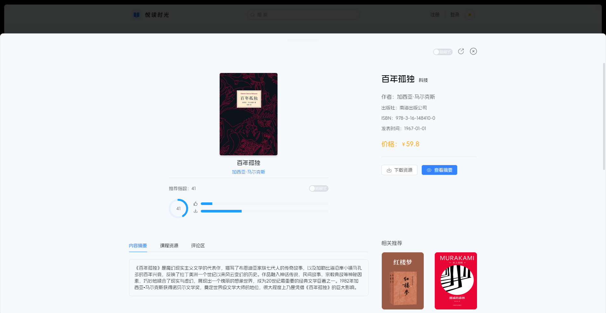
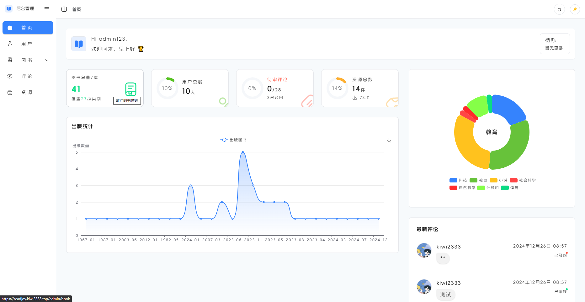
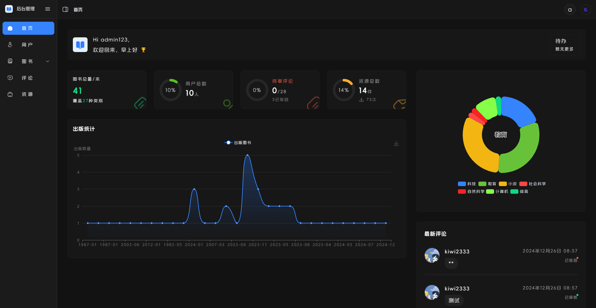
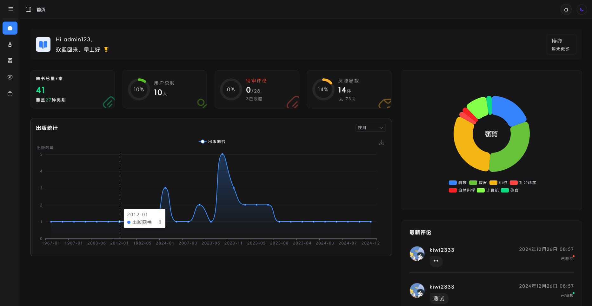
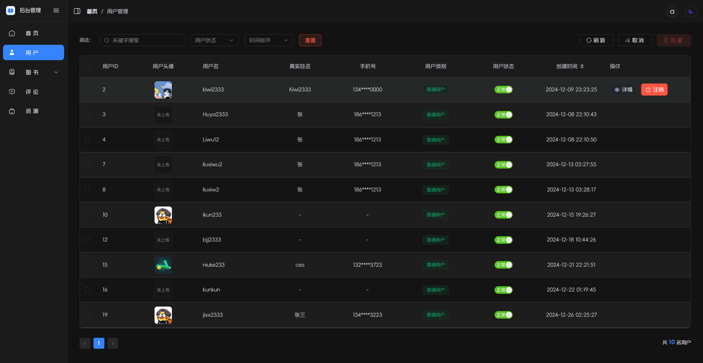
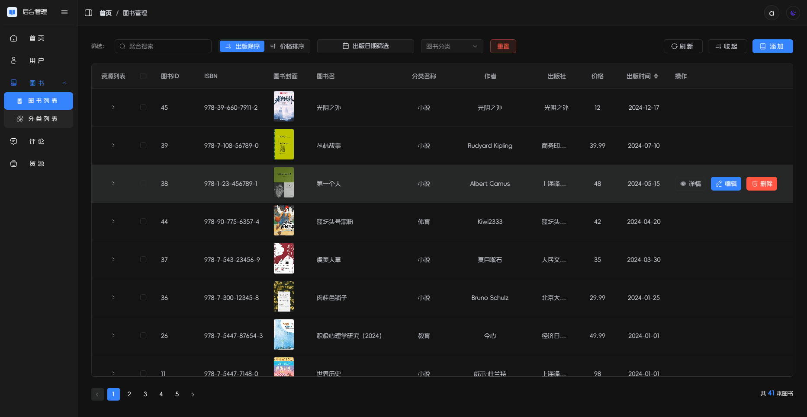
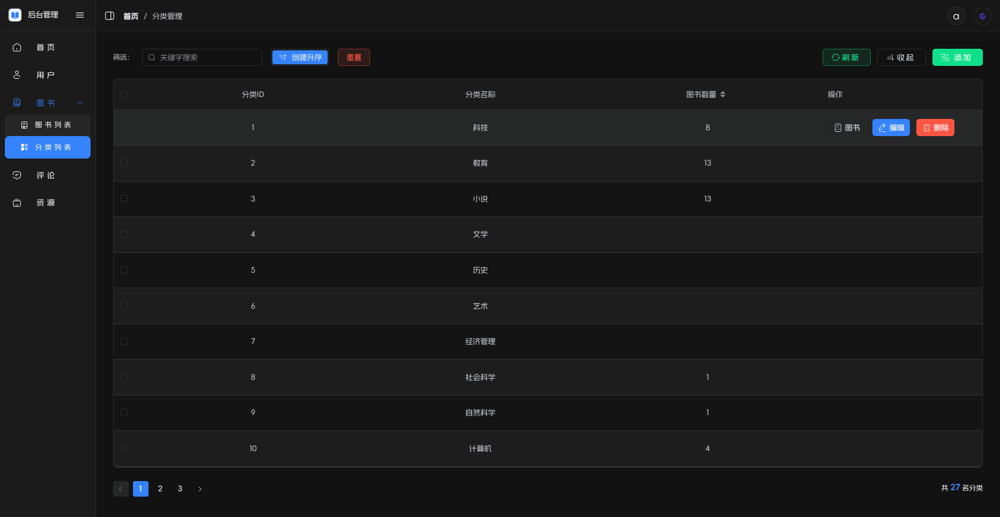
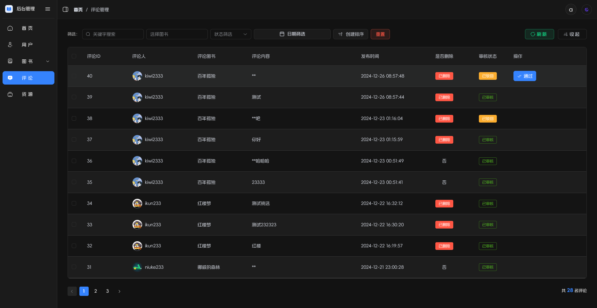
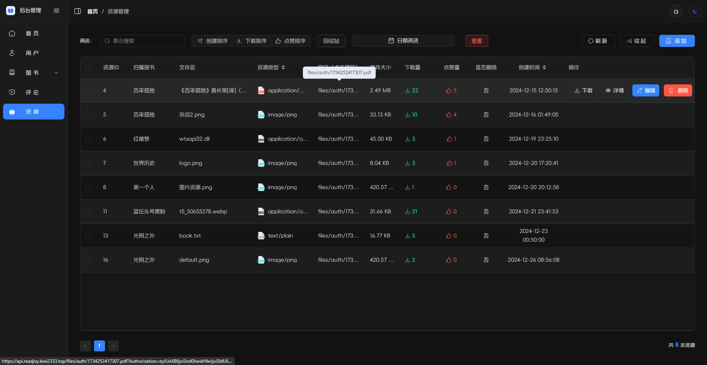
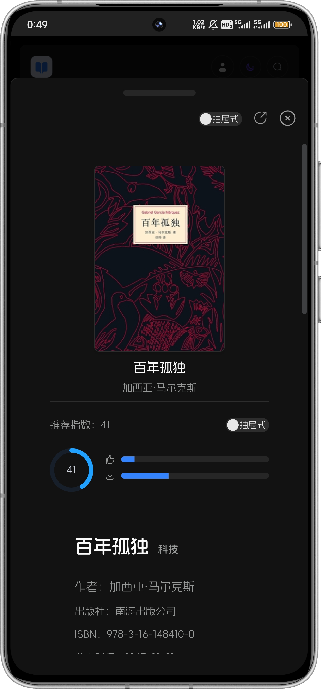

---
# https://vitepress.dev/reference/default-theme-home-page
layout: doc
title: "阅读时光 | Read Joy"
---


<script setup lang="ts">
import PublicResource from '../.vitepress/compnents/PublicResource.vue'
</script>

<div text-center flex-row-c-c flex-col>
  
</div>

# 阅读时光 | Read Joy

<!-- 公开仓库 -->
<PublicResource author="KiWi233333" repo-url="read-joy" />

## 项目介绍

欢迎来到悦读时光（Read-Joy）🎉 ：一个让阅读变得更加美好与便捷的网页应用！基于现代化的 Nuxt3 和 Spring Boot 技术栈，我们为您打造了一个简约而不简单的阅读平台。无论您是书籍爱好者，还是寻找灵感的创作者，这里都能满足您的需求。

注：本项目为`课程大作业`，数据库因课题`固定`，无法修改数据库，所以实现功能有限，仅供学习。

### 可能吸引您的地方

- `优雅的界面`：我们精心设计的用户界面，确保您在阅读时享受无与伦比的视觉体验。
- `智能推荐`：通过先进的 AI 技术，我们为您推荐最适合您的书籍，让每一次阅读都充满惊喜。
- `多样化功能`：从深色模式到便捷的搜索功能，悦读时光为您提供全方位的阅读体验。
- `社区互动`：与其他读者分享您的见解，参与讨论，提升您的阅读乐趣。

加入我们，开启您的阅读之旅，发现更多精彩内容！无论是经典文学还是最新畅销书，悦读时光都将是您最好的伙伴。让我们一起在书海中遨游，享受每一个悦读的瞬间！

### 默认账号

- 账号：ikun233
- 密码：123456

## 项目截图

- 前台 - 主页


- 全局深色模式


- 前台 - 搜索页


- 前台 - 详情页




- 前台 - AI推荐


- 前台 - 登录


- 后台 - 管理页面 



- 后台 - 管理深色模式





- 后台 - 用户页面



- 后台 - 书籍页面



- 后台 - 分类页面



- 后台 - 评论页面



- 后台 - 资源页面



 
- 移动端适配

<div align=center style="margin:1em; display:flex;flex-wrap:wrap;justify-content:center;">
 

 

 

</div>

## ⏳ 起步

### ✨ 开发

#### 🎨 前端

```sh
# 安装依赖
pnpm install
# 启动项目
pnpm run dev
```

#### 🖥 后端

```sh
pnpm run dev
```

后端：

Idea 打开项目，启动 `com.readjoy.readjoyapi.ReadJoyApiApplication` 类。


### 📦 部署

#### 1. 前端部署
  - 前端根目录下添加并配置`.prod.development`（可参考`.env.development`）
  - 运行 `pnpm run build` 打包
  - 部署到服务器，如：Nginx、Apache、Tomcat等

```sh
# 前端打包
pnpm run build

# 前端运行
pnpm run start

```

#### 2. 后端部署
  - 后端根目录下添加并配置`.prod.properties`（可参考`.dev.properties`）
  - 运行 `mvn clean package` 打包
  - 部署到服务器，如：Tomcat、Jetty等

```sh
# 后端打包
mvn clean package -Dmaven.test.skip=true

# 后端运行
java -jar target/read-joy-api-1.0.0.jar --spring.profiles.active=prod
```

### 🔧 前端 - 涉及技术栈 | Tech Stack
<details>
<summary>展开</summary>

| 类别         | 技术/组件          | 版本号       |
| ------------ | ----------------- | ------------ |
| 包管理器     | pnpm             | 9.14.4       |
| 框架         | Nuxt3            | ^3.14.1592   |
| UI 组件库    | Element Plus      | ^2.9.1       |
|              | Radix Vue         | ^1.9.11      |
|              | Element Plus Icons | >=0.2.6      |
| 状态管理     | Pinia            | ^2.3.0       |
|              | Pinia Persisted State | ^4.2.0    |
| 构建工具      | Vite             | ^6.0.2       |
|              | Webpack          | ^5           |
| 静态站点生成  | Nuxi             | -            |
| 服务端渲染    | Nitro            | -            |
| CSS 框架     | Tailwind CSS      | ^3.4.17      |
|              | Tailwind Merge    | ^2.5.5       |
|              | Tailwind CSS Animate | ^1.0.7     |
| TypeScript   | TypeScript       | 5.7.2        |
| ESLint 配置   | @antfu/eslint-config | ^3.12.0     |
|              | @nuxt/eslint      | ^0.7.4       |
|              | @unocss/eslint-config | ^0.65.2    |
| 代码质量      | ESLint           | ^9.17.0      |
|              | Consola          | ^3.2.3       |
| 动画         | @formkit/auto-animate | 0.8.2      |
| 图表         | ECharts          | ^5.5.1       |
| 日期处理     | Dayjs            | ^1.11.13     |
| Markdown 编辑器 | MD-Editor V3    | ^5.1.1       |
| 国际化       | -                | -            |
| PWA           | @vite-pwa/nuxt   | ^0.10.6      |
| Vue 插件      | @vueuse/nuxt     | ^12.2.0      |
| 版本控制钩子  | Husky            | -            |
| 代码提交规范  | lint-staged      | -            |

</details>

## 🖥 后端 - 涉及技术栈 | Tech Stack

<details>
<summary>展开</summary>

| 类型          | 库                                            | 版本号         | 功能描述                              |
|-------------|----------------------------------------------|-------------|-----------------------------------|
| **主框架**     | **Spring Boot**                              | **3.3.5**   | **Spring Boot核心依赖**               |
|             | spring-boot-starter-web                      |             | 提供Web应用支持，包括Tomcat和Spring MVC     |
|             | spring-boot-starter-validation               |             | 提供数据校验能力                          |
| **数据库与ORM** | **MyBatis Plus**                             | **3.5.9**   | **集成MyBatis Plus，增强的MyBatis功能**   |
|             | mybatis-plus-spring-boot3-starter            |             |                                   |
|             | mybatis-plus-jsqlparser                      |             | MyBatis Plus集成JSqlParser可增加扩展，分页等 |
|             | mybatis-plus-join-boot-starter               | 1.5.2       | 提供MyBatis Plus Join多表联查查询支持       |
|             | **MySQL**                                    |             | **MySQL数据库驱动**                    |
|             | mysql-connector-j                            | 8.0.29      |                                   |
| **缓存**      | **Redis**                                    | **3.3.5**   | **提供Redis缓存支持**                   |
|             | spring-boot-starter-data-redis               |             | 用于接口频控、数据缓存等                      |
| **安全**      | **JWT**                                      | **4.2.1**   | **提供JWT身份验证支持**                   |
|             | java-jwt                                     |             | 用户的身份认证和授权                        |
|             | **mica-xss**                                 | **2.7.6**   | **防止XSS攻击**                       |
| **工具类库**    | **Hutool**                                   | **5.8.25**  | **一个Java工具类库，提供��种工具类**            |
|             | hutool-all                                   |             |                                   |
|             | **Lombok**                                   | **1.18.24** | **简化Java对象封装的工具**                 |
|             | lombok                                       |             |                                   |
| **API文档**   | **Swagger**                                  | **4.4.0**   | **提供Swagger3 API文档支持**            |
|             | knife4j-openapi3-jakarta-spring-boot-starter |             |                                   |
| **日志**      | **Log4j2**                                   | **2.17.0**  | **提供日志记录支持**                     |

</details>


## 趋势


## 贡献

欢迎您为项目贡献代码！请确保在提交之前运行 `lint` 命令进行代码检查。

## License

此项目遵循 ``GNU Affero General Public License v3.0`` 许可证，具体内容请查看 LICENSE 文件。

希望您在使用此项目时感到愉快！如有任何问题，请随时联系。
