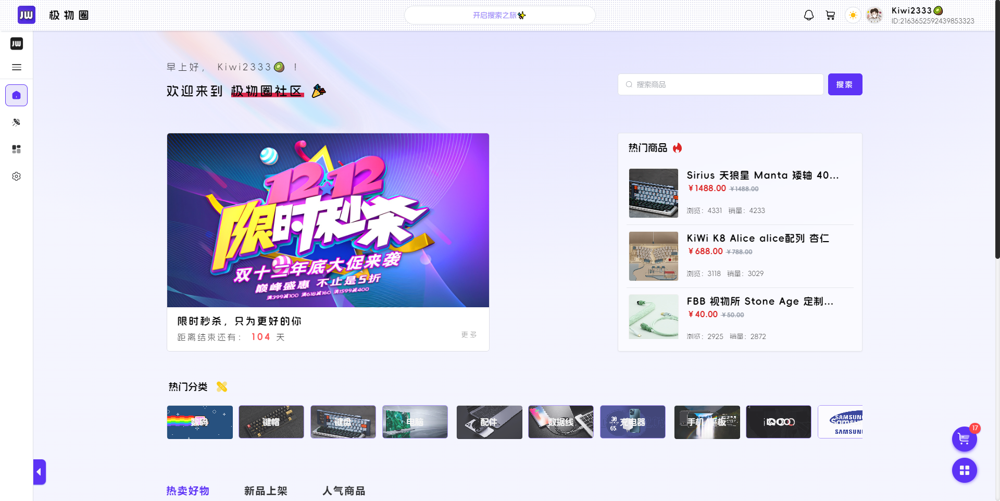
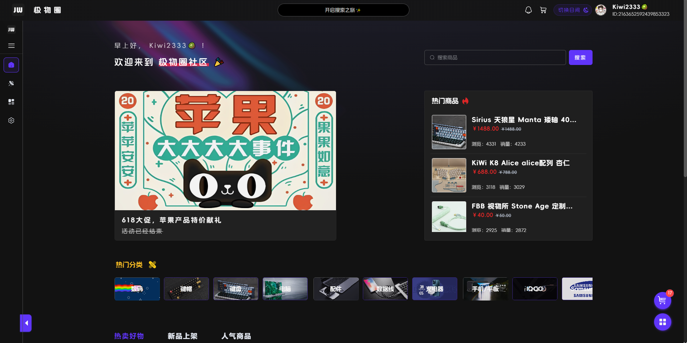
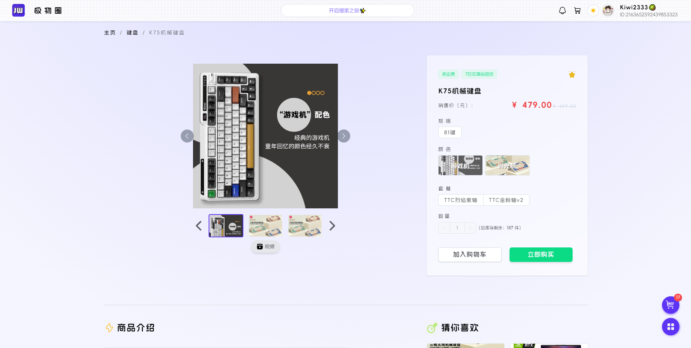
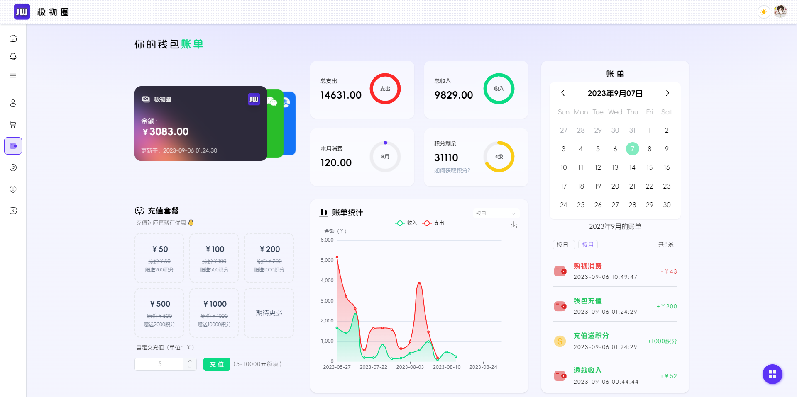
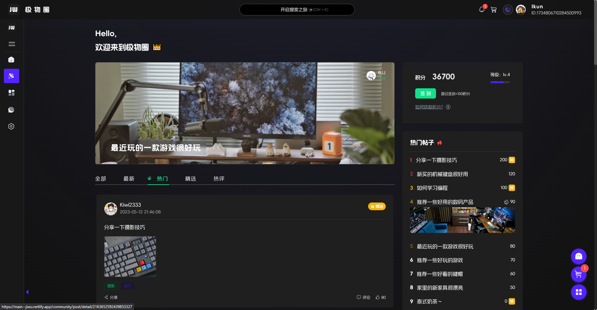
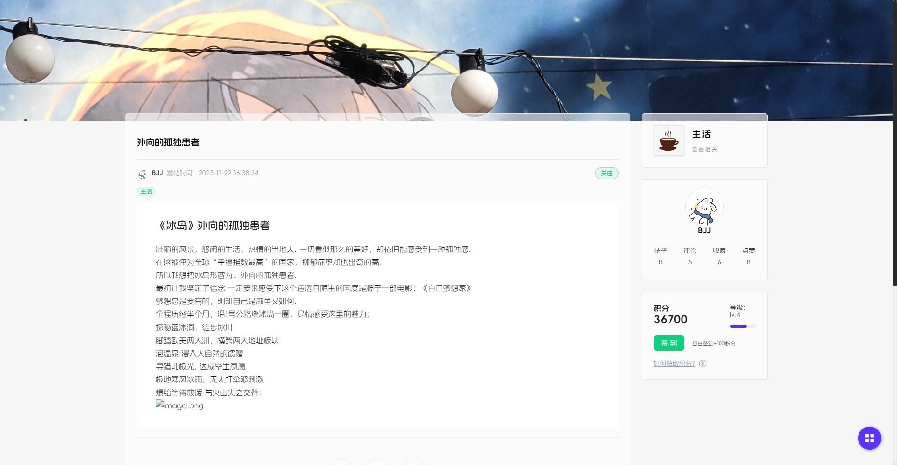
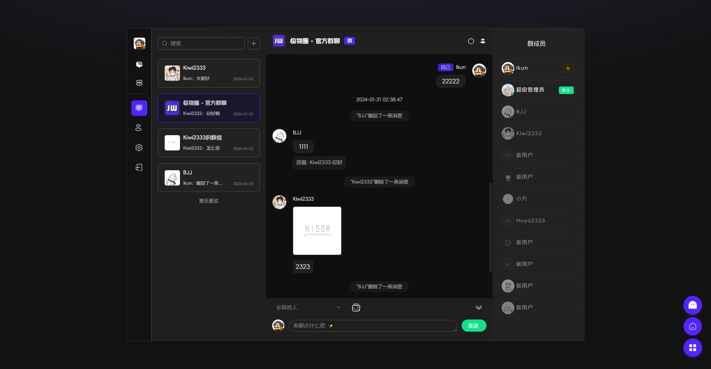
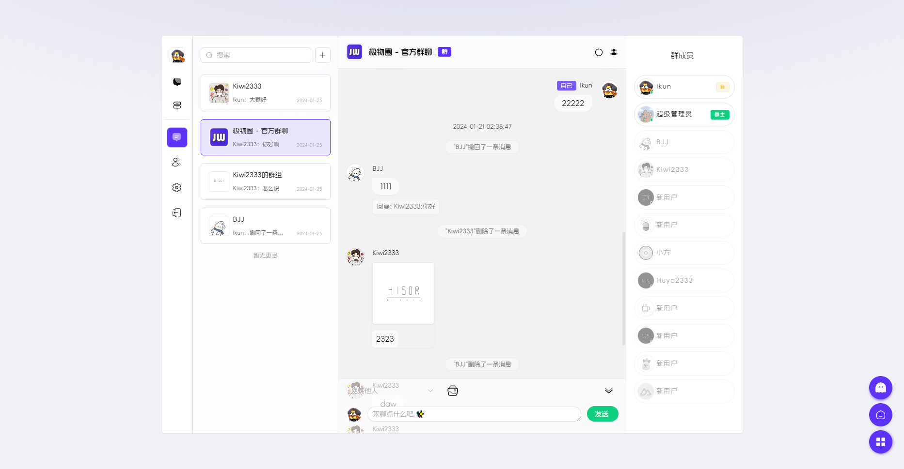
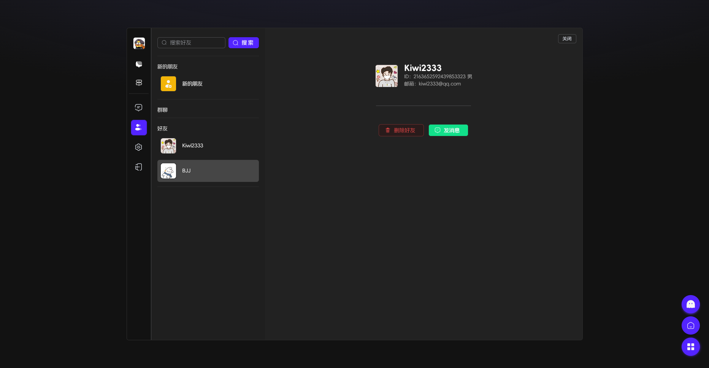

---
# https://vitepress.dev/reference/default-theme-home-page
layout: doc
title: "极物圈社区系统"
---

# 极物圈社区系统

## 项目介绍
>
>极物圈是一个综合性平台，集商城和社交功能于一体。在这个平台上，用户可以轻松购买虚拟商品，并且可以发布个人帖子，与他人互动，进行评论等。该平台注重用户体验，为用户提供了一个在你圈子交流、好物推荐、分享和购物的多功能环境。

## 项目链接

[极物圈社区系统](https://github.com/KiWi233333/jiwu-mall-web)

## 效果展示

---

---

---

---

---

---

---

---

---
