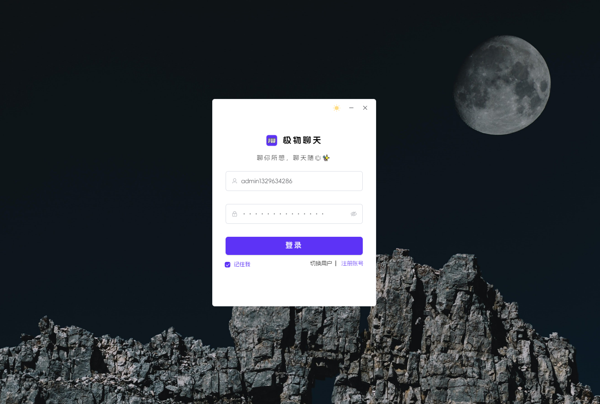
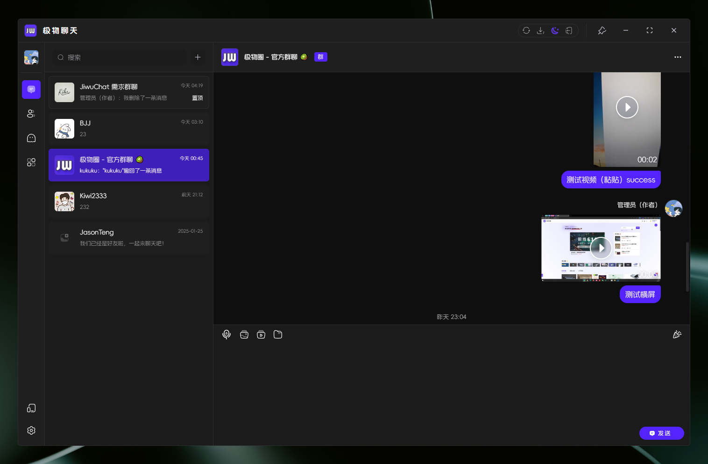
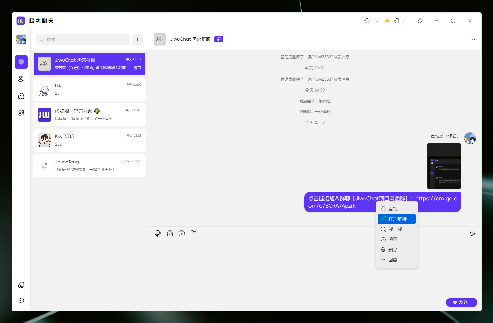
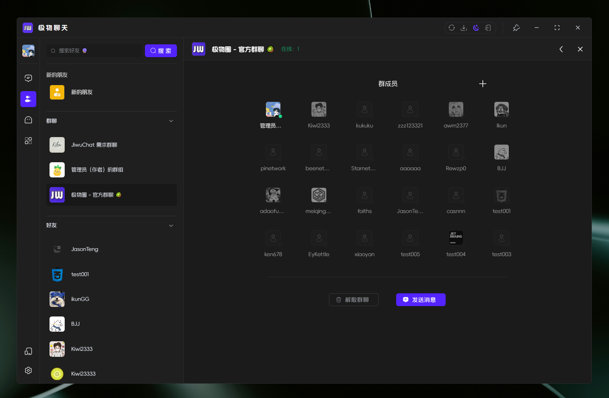
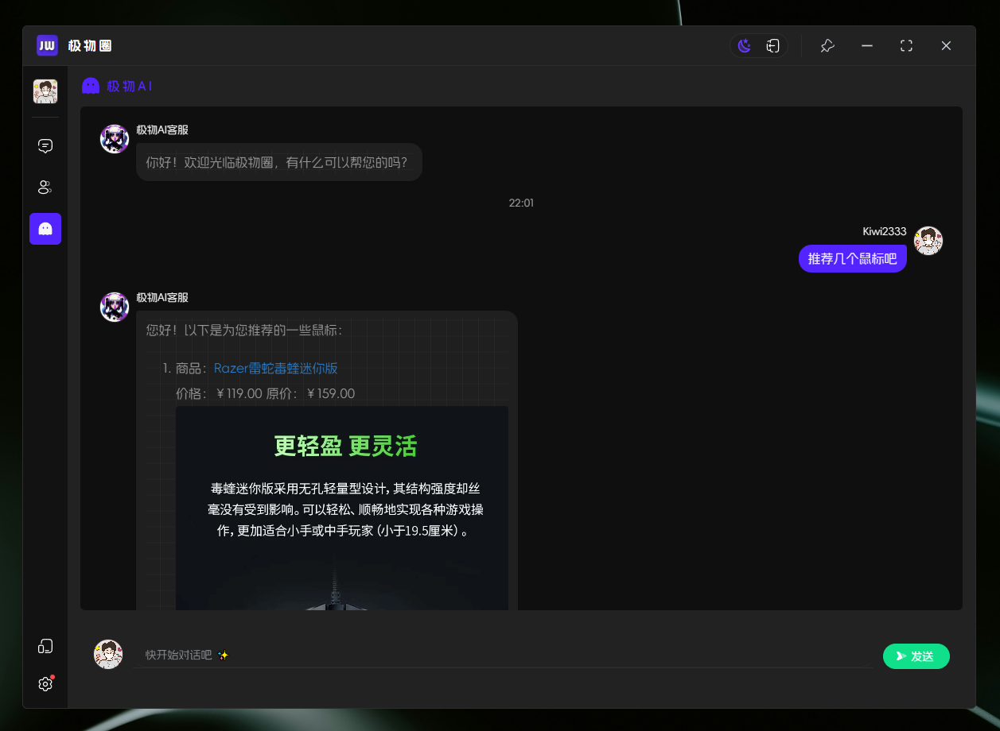
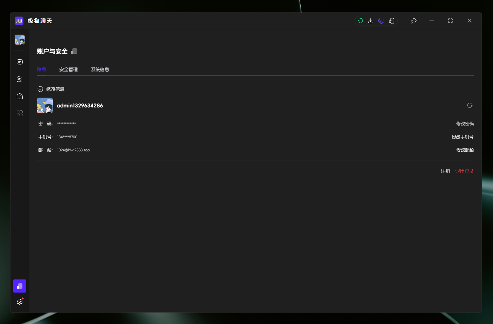
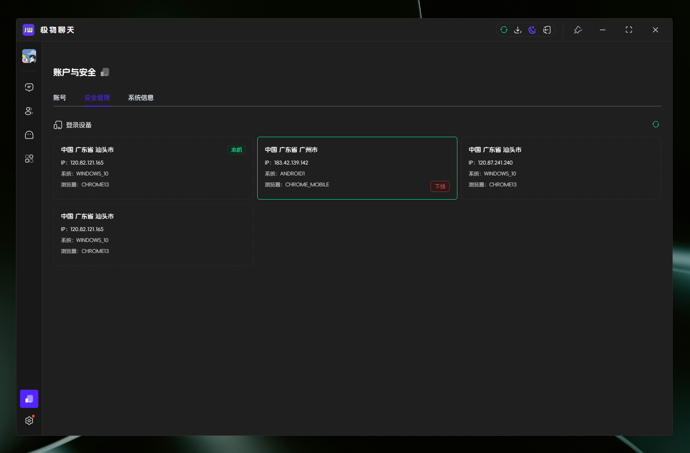
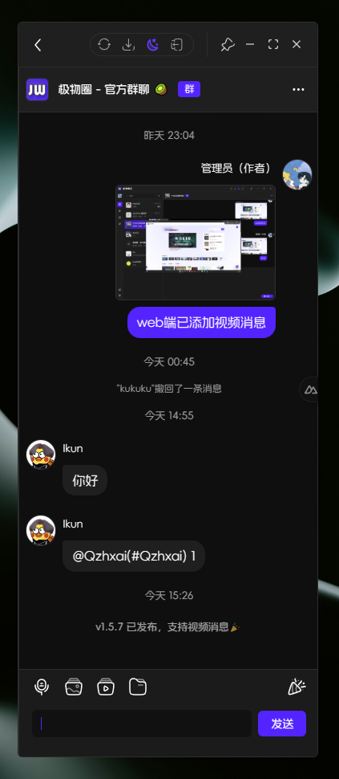
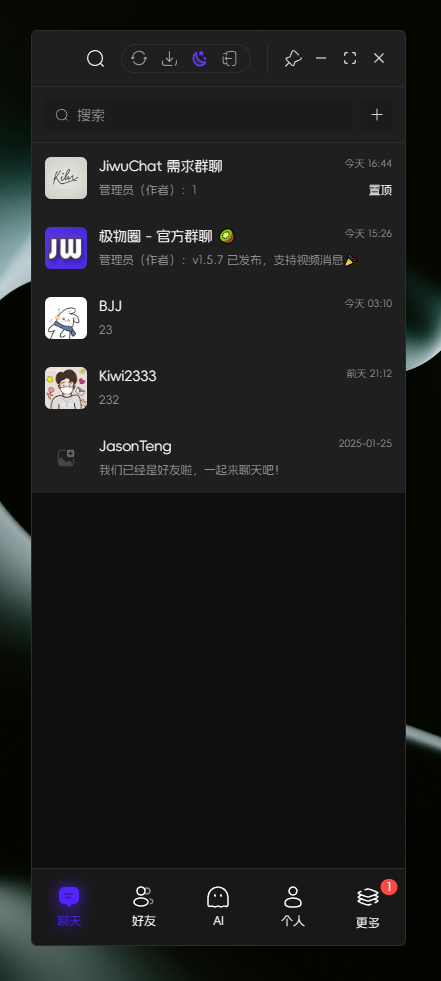

---
# https://vitepress.dev/reference/default-theme-home-page
layout: doc
title: "极物聊天 | JiwuChat"
---


<script setup lang="ts">
import PublicResource from '../.vitepress/compnents/PublicResource.vue'
import JiwuChatDownTable from '../.vitepress/compnents/JiwuChatDownTable.vue'
</script>

<div text-center flex-row-c-c flex-col>
  
</div>

# 极物聊天 | JiwuChat

<!-- 公开仓库 -->
<PublicResource author="KiWi233333" repo-url="jiwu-mall-chat-tauri" />

## 🎈 项目介绍

>极物聊天 Tauri APP 是一个基于Nuxt3 + Tauri + Element-plus 基本框架的聊天桌面应用。它提供了一个美观的用户界面，并集成了聊天和社交功能。同时，它还支持AI购物聊天和全局夜间模式。用户可以通过该应用进行实时聊天、分享动态和AI客服问答。
>

- 体验链接：[网页版](https://chat.jiwu.kiwi233.top/)

## 💡 技术栈

```txt
基于Nuxt3 + Tauri + Element-plus 基本框架
```

## 💻 下载

<JiwuChatDownTable />

## 📸 项目截图

- 聊天桌面应用 Login



- 聊天桌面应用 Chat



- 全局夜间模式 Light / Dark



- 聊天社交



- AI购物聊天



- 账号与安全





- 响应式




## 🤝 如何使用？

### ⏳ 起步 | Project Setup

```sh
# node 版本 >= 16
npm install -g pnpm

pnpm install
```

### ✨ 开发

```sh
# 建议分开运行
# 1）启动nuxt
pnpm run dev:nuxt 
# 2）启动tauri
pnpm run dev:tauri 
```

### 📦 打包

```sh
pnpm run build:tauri
```

### ❌ pnpm install error

查看源

```sh
pnpm get registry 
```

临时修改

```sh
pnpm --registry https://registry.npm.taobao.org install any-touch
```

持久使用

```sh
pnpm config set registry https://registry.npm.taobao.org
```

还原

```sh
pnpm config set registry https://registry.npmjs.org
```

### 🔧 涉及技术栈 | Tech Stack

| 类别         | 技术/组件          | 版本号       |
| ------------- | ------------------ | ------------ |
| 框架         | Nuxt3              | 3.12.2       |
|              | Tauri              | 1.5.6        |
| UI 组件库     | Element Plus       | 2.7.6        |
| 状态管理     | Pinia              | 2.1.7        |
| 工具库       | Vueuse             | 10.11.0      |
| 构建与开发工具 | Nuxi               | lts        |
|              | Vite               | lts         |
| 代码质量     | ESLint             | 8.56.0       |
|              | Prettier           | 3.3.2        |
| 类型检查     | TypeScript         | 5.3.2        |
| 样式处理     | Sass               | 1.77.6       |
