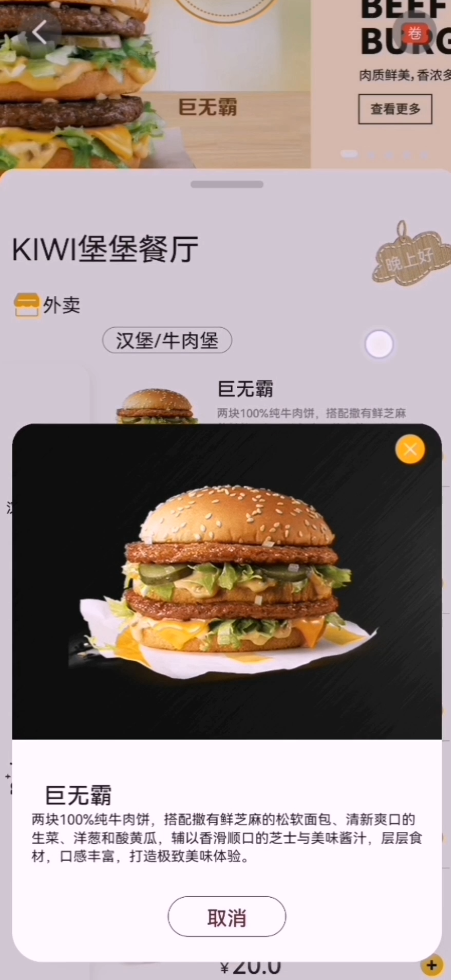
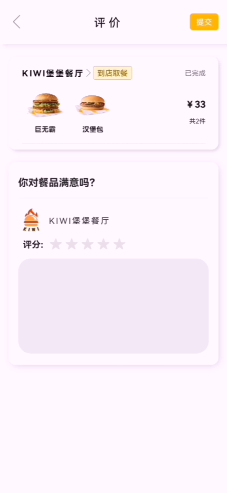

---
# https://vitepress.dev/reference/default-theme-home-page
layout: doc
title: "麦当劳外卖（鸿蒙）"
---

# 麦当劳外卖（鸿蒙）

## 项目介绍

> 项目基于鸿蒙系统，使用Java语言开发，实现了麦当劳外卖的点餐功能。用户可以通过该应用浏览菜单、选择菜品、添加到购物车，并完成下单支付。项目使用鸿蒙系统提供的UI组件和API。

## 效果展示

  
  
  
  
  
  
  
  
  
  

